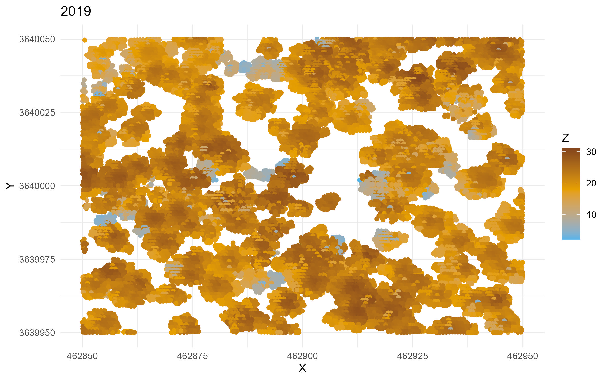
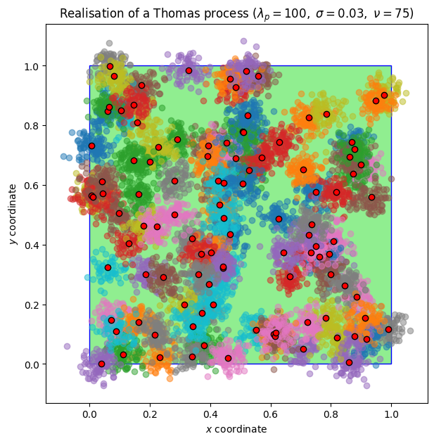

# Project: Counting Trees

Welcome to the **Counting Trees Project** GitLab repository! As the title suggests, the goal of this project is to _count trees_. You might be asking, "What do you mean?" 🤔 Let us break it down for you...

## LiDAR 📡 and Counting Trees 🌳

**LiDAR** (Light Detection and Ranging) is a remote sensing technology that uses laser pulses to measure distances between the sensor and objects. It creates _highly accurate_ 3D maps of environments.

In this project, we are given a LiDAR output for a forest, which has already been normalized.[^1] The output points have been projected into 2D space (as if we are viewing them from above):

As you can see in the image above, this set of points is quite dense, making it challenging to count the trees manually. However, each cluster of points essentially represents one tree.

## Spatial Point Processes 🧑‍🏫

A spatial point process is a mathematical model used to describe points (in 2D, 3D, or even n-D 😲) that are randomly distributed. For this project, we focus on two types of spatial point processes:

1. **Poisson Point Processes**: These processes describe situations where the number of points follows a Poisson distribution, and the points are uniformly distributed in $\mathbb{R}^2$.

2. **Thomas Point Processes**: These are cluster processes where parent points follow a spatial Poisson distribution. Each parent point has some offspring, and the number of offspring also follows a Poisson distribution. The offspring are distributed around the parent point following a 2D Gaussian distribution.

A realization of a dense Thomas Point Process looks like this:

This is suspiciously similar to what we see in the LiDAR output. The only difference is the size of each cluster. Therefore, we are using statistical methods to infer the parameters of the superposition of Thomas processes that could recreate the LiDAR output, which will allow us to estimate the number of trees.

[^1]: The original LiDAR output consists of points in 3D space where the laser rays intersect with objects. However, it does not account for the altitude offset introduced by the topology of the forest.
